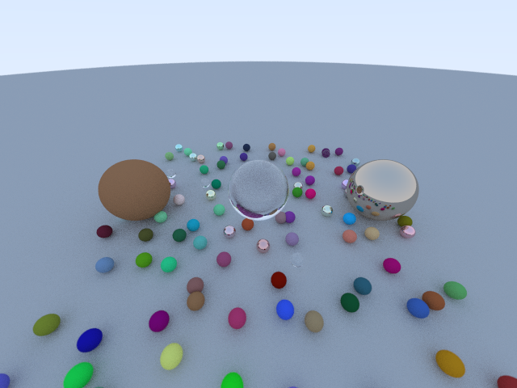

## Ray Tracing
Following [Ray Tracing In One Weekend](https://raytracing.github.io/books/RayTracingInOneWeekend.html)

### To build and run:

```sh
sudo sh ./bootstrap.sh
```

`WIDTH` and `HEIGHT` are avaiable as environment variables to configure the size of the resulting image
```sh
make run
```


